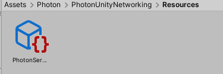
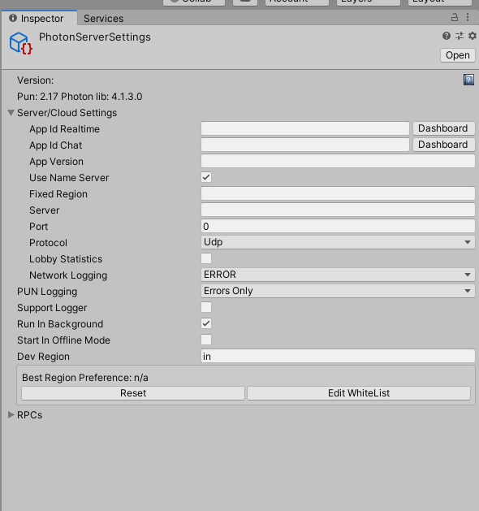

# Unity_Multiplayer
Skeletal unity (2019.3.14f1) project for multiplayer system.

Steps to implement:

1] Open the project in Unity  
2] Go to location

3] Select the file PhotonServerSettings & Go to inspector Window

4] Click on Dashboard. Photon website will popup.

5] Now create a account in PhotonNetworking(Free). Create a project with PUN Realtime.

6] Addd the unique AppID to the inspector window.

7] Done. Your server is created and handle by Photon.

More Details : https://www.photonengine.com/pun
